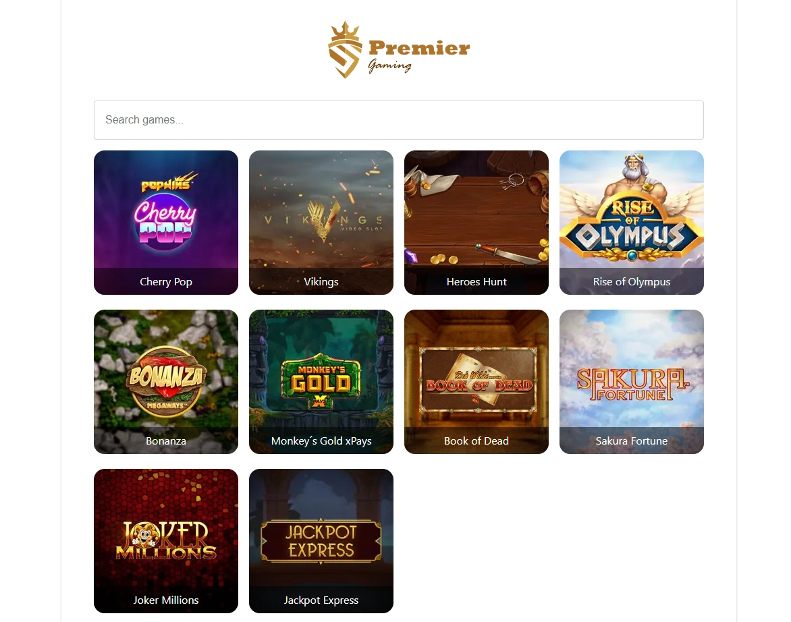
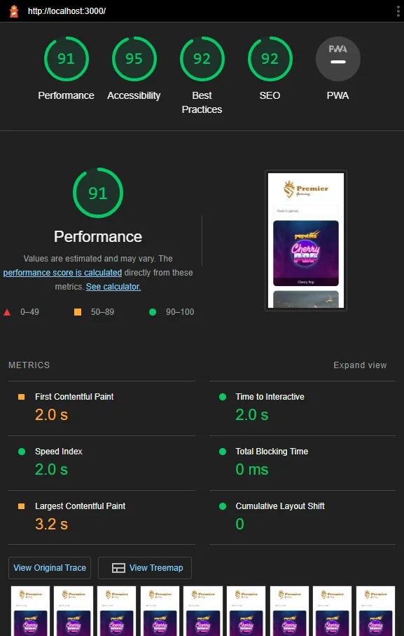

# Vue Casino Experimental Test

https://nuxt3-test-bice-six.vercel.app/




# Notes
Use nodejs 17.9.1 - The cake is a lie. Latest LTS doesn't work.
1. NUXT 3 is still brand new. I would argue it's not ready for production yet.
2. Styling options are limited. SASS/LESS is 15 years old. Support for stitches.dev or better support for other css-in-js solutions would be nice.
3. Not had time to componentise everything yet. I'm sure there are some components that could be reused.
4. Server or static rendering
5. `npm run generate` then `npm run preview` to see the static site.
6. `npm run build` then `npm run preview` to see the server rendered site.
7. Open chrome in incognito mode and run a lighthouse audit.

Look at the [Nuxt 3 documentation](https://nuxt.com/docs/getting-started/introduction) to learn more.

## Setup

Make sure to install the dependencies:

```bash
# yarn
yarn install

# npm
npm install

# pnpm
pnpm install --shamefully-hoist
```

## Development Server

Start the development server on http://localhost:3000

```bash
npm run dev
```

## Production

Build the application for production:

```bash
npm run build
```

Locally preview production build:

```bash
npm run preview
```

Check out the [deployment documentation](https://nuxt.com/docs/getting-started/deployment) for more information.
